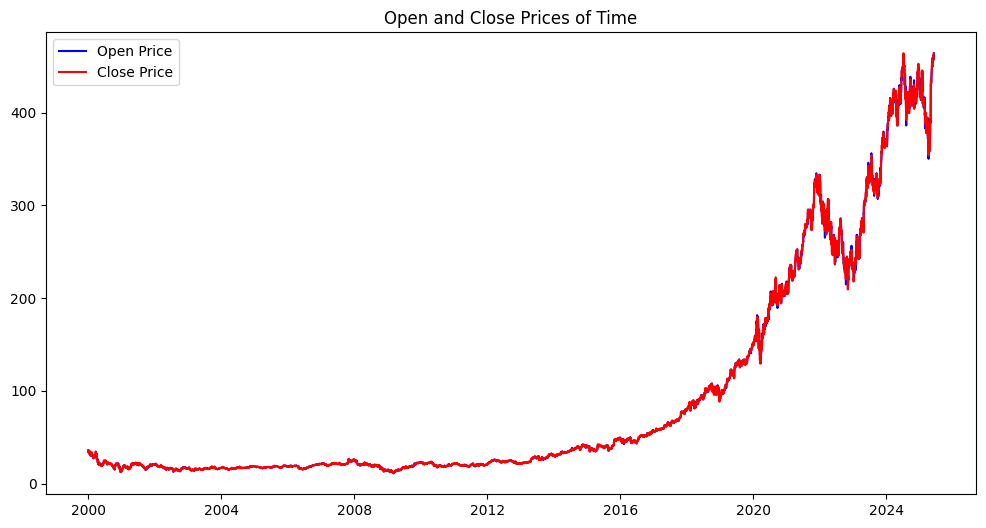

# 📈 LSTM Stock Price Prediction – Microsoft (MSFT)

This project implements a Long Short-Term Memory (LSTM) neural network to predict Microsoft (MSFT) stock prices using historical data. The model was trained on `yfinance` data from 2000 to the present and evaluated using standard regression metrics.

---

## 🚀 Project Highlights

- Stock: **Microsoft Corporation (MSFT)**
- Model: **LSTM Neural Network**
- Data Source: [Yahoo Finance](https://finance.yahoo.com/) via `yfinance` API
- Features: Open, High, Low, Close, Volume
- Frameworks: `TensorFlow`, `Keras`, `NumPy`, `Pandas`, `Matplotlib`, `Seaborn`

---

## 📊 Evaluation Metrics

| Metric   | Value   |
|----------|---------|
| MAE      | 15.54   |
| RMSE     | 20.76   |
| R² Score | 0.9326  |

✅ These metrics indicate strong predictive performance, with over **93% of the variance in the closing price explained** by the model.

---

## 📉 Visualizations

The project includes the following visualizations for exploratory data analysis and model evaluation:

- 📘 **Open vs Close Price**
  
- 🔁 **Stock Volume Over Time**
- 🌡️ **Feature Correlation Heatmap**
- 📈 **Close Price Over Time**
- 🤖 **Actual vs Predicted Closing Prices**

---

## 🧠 Model Workflow

1. **Data Collection** – Downloaded historical MSFT data using `yfinance`.
2. **Data Preprocessing** – Normalized data and created time-series sequences.
3. **Model Building** – Built and trained an LSTM model using `TensorFlow/Keras`.
4. **Evaluation** – Computed MAE, RMSE, and R² score on the test set.
5. **Visualization** – Plotted actual vs predicted prices and other key insights.

---

